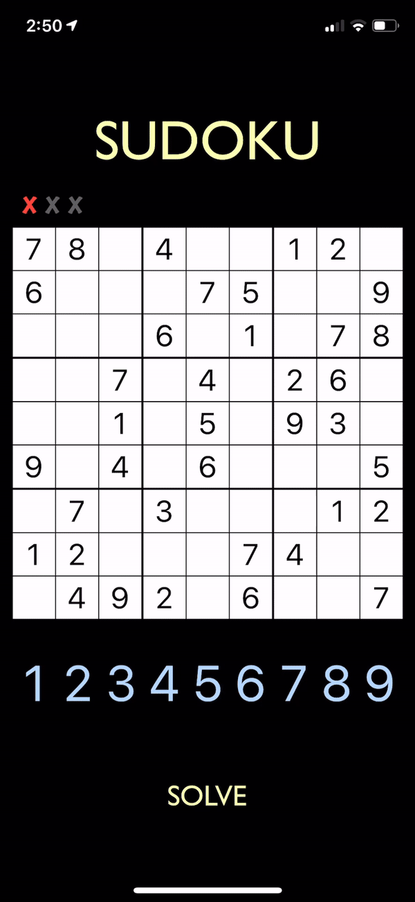

# SudokuSolver
iOS application: Sudoku game and solver with visualization.

This project is a single view iOS application that gives the viewer a Sudoku board that 
they can either solve for themselves or solve instantly by watching a backtracking algorithm 
solve the given sudoku board. (fullSolve.MP4) shows a complete solve executed by backtracking algorithm. 
Below is a (.gif) previewing the application. 

Project inspired by Tech With Tim on Youtube.com
